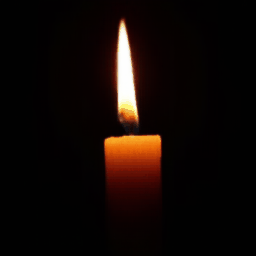

# VAE-candle-ONNX-react

## Description

VAE model was used to extract representation of candle movement from YouTube video of burning candle. Sampling frames from laten space we can simulate candle movement even if it is not based on physics rules. The model is converted to ONNX format and used in React app. We can emulate candle movement completely on client side.

This gif was created by VAE model. The model was trained on 128642images of size 256x256. The model was trained for 28 epochs. 

Check out the [demo](https://old.hermandaniel.com/#/candle).
